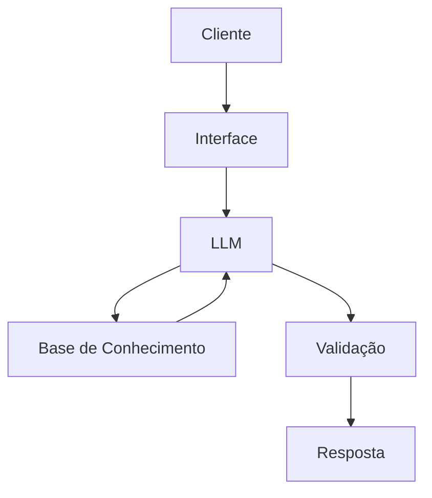

# 💰 ArielFIN — Educador Financeiro com IA Generativa

Agente conversacional desenvolvido como projeto final do laboratório DIO **"Bia do Futuro"**, com foco em educação financeira para iniciantes.

---

## 🎯 O que é

**ArielFIN** é um chatbot educativo que traduz conceitos de finanças pessoais em linguagem simples e acessível. Ele não dá dicas de investimento — ele ensina você a entender o seu dinheiro.

> *"Oi! Vamos simplificar suas finanças?"*

---

## 🧠 Persona

| Atributo | Detalhe |
|---|---|
| **Nome** | ArielFIN |
| **Estilo** | Didático, amigável, sem pressa |
| **Linguagem** | Informal, sem jargões técnicos |
| **Público** | Quem está começando a cuidar do próprio dinheiro |

---

## 🏗️ Arquitetura



---

## 📁 Estrutura do Repositório

```
dio-lab-bia-do-futuro/
├── data/                          # Dados mockados
│   ├── transacoes.csv
│   ├── historico_atendimento.csv
│   ├── perfil_investidor.json
│   └── produtos_financeiros.json
├── docs/
│   ├── 01-documentacao-agente.md  # Caso de uso e persona
│   ├── 02-base-conhecimento.md    # Estratégia de dados
│   ├── 03-prompts.md              # Engenharia de prompts
│   ├── 04-metricas.md             # Avaliação do agente
│   └── 05-pitch.md                # Apresentação do projeto
├── src/
│   └── app.py                     # Aplicação Streamlit
├── assets/
└── examples/
```

---

## 🛡️ Segurança

- Responde apenas com base nos dados fornecidos
- Admite quando não sabe a resposta
- **Não** recomenda investimentos específicos
- **Não** acessa dados bancários reais
- **Não** substitui consultoria financeira profissional

---

## 🚀 Como Rodar

```bash
# Instale as dependências
pip install streamlit

# Suba o modelo local (requer Ollama instalado)
ollama run llama3

# Execute a aplicação
streamlit run src/app.py
```

---

## 🛠️ Stack

`Python` · `Streamlit` · `Ollama` · `LLM local` · `JSON/CSV`

---

*Projeto desenvolvido para o laboratório DIO — Bia do Futuro.*
