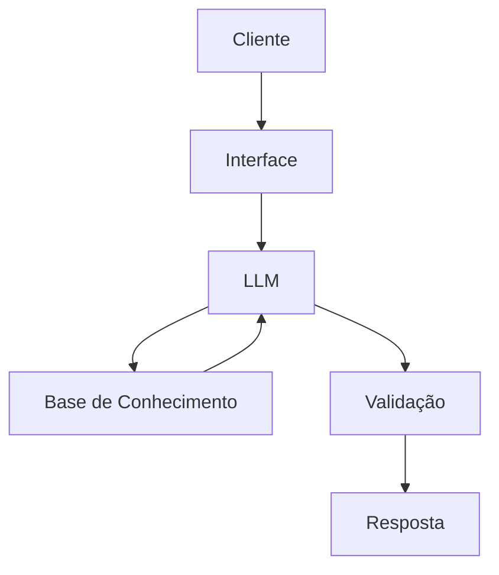

# Documentação do Agente

## Caso de Uso

### Problema
> Qual problema financeiro seu agente resolve?

Muitos iniciantes não sabem por onde começar quando o assunto é finanças pessoais. Conceitos como reserva de emergência ou controle de gastos parecem complicados demais.  

### Solução
> Como o agente resolve esse problema de forma proativa?

O agente traduz esses conceitos em explicações rápidas e fáceis, mostrando exemplos práticos sem recomendar investimentos específicos.  

### Público-Alvo
> Quem vai usar esse agente?

Quem está começando a cuidar do próprio dinheiro e precisa de orientação básica.

---

## Persona e Tom de Voz

### Nome do Agente
ArielFin

### Personalidade
> Como o agente se comporta? (ex: consultivo, direto, educativo)

Didático e amigável, sempre disposto a ensinar sem pressa.  

### Tom de Comunicação
> Formal, informal, técnico, acessível?

Informal e acessível, com linguagem clara e sem termos técnicos.  

### Exemplos de Linguagem
- Saudação: "Oi! Vamos simplificar suas finanças?"  
- Confirmação: "Beleza, já entendi o que você precisa."  
- Erro/Limitação: "Não consigo responder isso agora, mas posso te explicar o conceito."

---

## Arquitetura

### Diagrama

### Componentes

| Componente | Descrição |
|------------|-----------|
| Interface | Chatbot em Streamlit |
| LLM | Ollama (local) |
| Base de Conhecimento | JSON/CSV mockados na pasta `data`|
| Validação | Checagem de consistência das respostas |

---

## Segurança e Anti-Alucinação

### Estratégias Adotadas

- [x] Responde apenas com base nos dados fornecidos
- [x] Admite quando não sabe
- [x] Não recomenda investimentos específicos

### Limitações Declaradas
> O que o agente NÃO faz?

- Não substitui consultoria financeira
- Não acessa dados bancários
- Não recomenda produtos ou investimentos