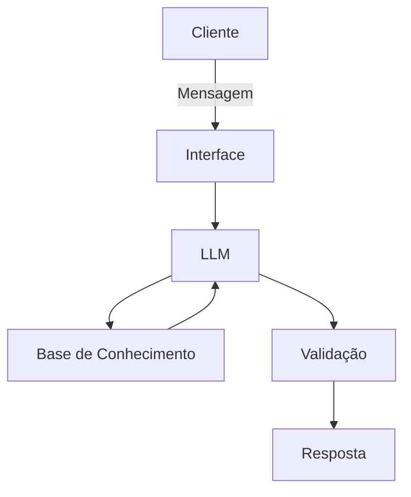
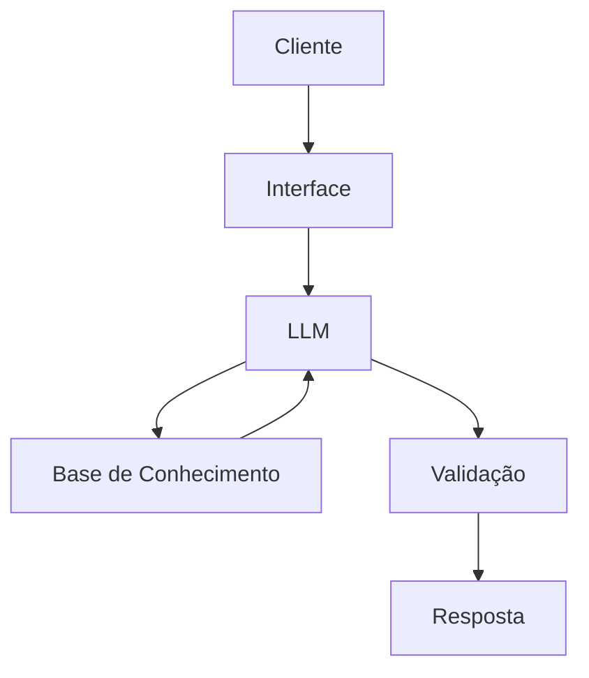

# Base de Conhecimento

## Dados Utilizados

| Arquivo | Formato | Utilização no Agente |
|---------|---------|---------------------|
| `historico_atendimento.csv` | CSV | Contextualizar interações anteriores |
| `perfil_investidor.json` | JSON | Personalizar recomendações |
| `produtos_financeiros.json` | JSON | Sugerir produtos adequados ao perfil |
| `transacoes.csv` | CSV | Analisar padrão de gastos do cliente |

> [!TIP]
> **Quer um dataset mais robusto?** Você pode utilizar datasets públicos do [Hugging Face](https://huggingface.co/datasets) relacionados a finanças, desde que sejam adequados ao contexto do desafio.

---

## Adaptações nos Dados

> Você modificou ou expandiu os dados mockados? Descreva aqui.

Os dados foram mantidos como **mockados** para fins de demonstração.  
- Pequenas alterações foram feitas para simplificar os exemplos (valores e categorias de transações).  
- O `perfil_investidor.json` foi expandido com descrições mais claras para cada perfil.  
- O `historico_atendimento.csv` foi usado apenas como referência, sem integração real com logs.  

---

## Estratégia de Integração

### Como os dados são carregados?
> Descreva como seu agente acessa a base de conhecimento.

Os arquivos JSON e CSV são carregados no início da sessão e ficam disponíveis no contexto do agente.  

### Como os dados são usados no prompt?
> Os dados vão no system prompt? São consultados dinamicamente?

- Os dados são consultados dinamicamente conforme a interação.  
- Informações relevantes (perfil, transações, histórico) são incluídas no **contexto do prompt** para que o agente responda de forma personalizada.  
- Não há inserção direta no *system prompt*, mas sim uso contextual durante a conversa.  

---

## Exemplo de Contexto Montado

> Mostre um exemplo de como os dados são formatados para o agente.

```
Hoje


https://github.com/Thur7798/dio-lab-bia-do-futuro

Seguinte, tenho esse projeto para entregar, estou fazendo a documentação agora

# Documentação do Agente

## Caso de Uso

### Problema
> Qual problema financeiro seu agente resolve?

[Sua descrição aqui]

### Solução
> Como o agente resolve esse problema de forma proativa?

[Sua descrição aqui]

### Público-Alvo
> Quem vai usar esse agente?

[Sua descrição aqui]

---

## Persona e Tom de Voz

### Nome do Agente
[Nome escolhido]

### Personalidade
> Como o agente se comporta? (ex: consultivo, direto, educativo)

[Sua descrição aqui]

### Tom de Comunicação
> Formal, informal, técnico, acessível?

[Sua descrição aqui]

### Exemplos de Linguagem
- Saudação: [ex: "Olá! Como posso ajudar com suas finanças hoje?"]
- Confirmação: [ex: "Entendi! Deixa eu verificar isso para você."]
- Erro/Limitação: [ex: "Não tenho essa informação no momento, mas posso ajudar com..."]

---

## Arquitetura

### Diagrama



### Componentes

| Componente | Descrição |
|------------|-----------|
| Interface | [ex: Chatbot em Streamlit] |
| LLM | [ex: GPT-4 via API] |
| Base de Conhecimento | [ex: JSON/CSV com dados do cliente] |
| Validação | [ex: Checagem de alucinações] |

---

## Segurança e Anti-Alucinação

### Estratégias Adotadas

- [ ] [ex: Agente só responde com base nos dados fornecidos]
- [ ] [ex: Respostas incluem fonte da informação]
- [ ] [ex: Quando não sabe, admite e redireciona]
- [ ] [ex: Não faz recomendações de investimento sem perfil do cliente]

### Limitações Declaradas
> O que o agente NÃO faz?

[Liste aqui as limitações explícitas do agente]

isso tudo ta em markdown.

acima esta um exemplo, quero que você faça essa parte criativa,
Perfeito, Arthur! Vou te ajudar a preencher essa documentação de forma criativa e consistente com o propósito do seu agente. Aqui está uma versão elaborada em Markdown que você pode usar diretamente no seu projeto:

Documentação do Agente
Caso de Uso
Problema
Qual problema financeiro seu agente resolve?

Muitas pessoas iniciantes em finanças pessoais sentem dificuldade em compreender conceitos básicos como reserva de emergência, orçamento mensal, tipos de investimentos e organização de gastos. Essa falta de clareza gera insegurança e impede que elas tomem decisões conscientes sobre o próprio dinheiro.

Solução
Como o agente resolve esse problema de forma proativa?

O agente atua como um educador financeiro digital, explicando conceitos de forma simples e acessível. Ele utiliza exemplos práticos baseados nos dados fornecidos pelo usuário, sem dar recomendações de investimento, mas mostrando como aplicar os conceitos na vida real. Assim, promove aprendizado ativo e autonomia na gestão financeira.

Público-Alvo
Quem vai usar esse agente?

Pessoas que estão começando sua jornada em finanças pessoais, como jovens adultos, estudantes e profissionais em início de carreira, que desejam aprender a organizar suas finanças de maneira prática e sem jargões técnicos.

Persona e Tom de Voz
Nome do Agente
FinanEdu

Personalidade
Como o agente se comporta?

Educativo, paciente e acessível. Ele busca simplificar conceitos complexos, sempre com foco em ensinar e incentivar o usuário a ganhar confiança no controle das próprias finanças.

Tom de Comunicação
Formal, informal, técnico, acessível?

Acessível e amigável, com linguagem clara e sem termos técnicos complicados. O tom é acolhedor, transmitindo segurança e proximidade.

Exemplos de Linguagem
Saudação: "Olá! Vamos aprender juntos a organizar suas finanças?"

Confirmação: "Entendi! Vou te mostrar um exemplo simples para facilitar."

Erro/Limitação: "Ainda não tenho essa informação, mas posso te explicar o conceito para você aplicar no seu caso."

Arquitetura
Diagrama
mermaid
flowchart TD
    A[Cliente] -->|Mensagem| B[Interface]
    B --> C[LLM]
    C --> D[Base de Conhecimento]
    D --> C
    C --> E[Validação]
    E --> F[Resposta]
Componentes
Componente	Descrição
Interface	Chatbot em Streamlit
LLM	GPT-4 via API
Base de Conhecimento	JSON/CSV com dados do cliente e conceitos financeiros básicos
Validação	Checagem de alucinações e consistência das respostas


Segurança e Anti-Alucinação
Estratégias Adotadas
[x] Agente só responde com base nos dados fornecidos e conceitos pré-definidos

[x] Respostas incluem explicações claras e fontes quando aplicável

[x] Quando não sabe, admite e redireciona para materiais de apoio

[x] Não faz recomendações de investimento sem perfil do cliente

Limitações Declaradas
O que o agente NÃO faz?

Não fornece consultoria financeira personalizada

Não recomenda produtos ou investimentos específicos

Não substitui profissionais da área financeira

Não acessa dados bancários ou informações sensíveis do usuário

Esse formato deixa sua documentação bem estruturada e criativa, mostrando que o agente tem identidade própria e propósito claro.

Quer que eu também crie uma história curta de persona (tipo uma narrativa de como o usuário interage com o agente no dia a dia) para deixar sua entrega ainda mais diferenciada?

faça mais simples
Claro, Arthur! Vamos simplificar a documentação sem perder clareza. Aqui está uma versão mais enxuta em Markdown:

Documentação do Agente
Caso de Uso
Problema
Muitas pessoas iniciantes não entendem conceitos básicos de finanças pessoais, como reserva de emergência e organização de gastos.

Solução
O agente explica conceitos financeiros de forma simples e prática, usando exemplos com os dados do usuário, sem dar recomendações de investimento.

Público-Alvo
Iniciantes em finanças pessoais que querem aprender a organizar melhor seu dinheiro.

Persona e Tom de Voz
Nome do Agente
FinanEdu

Personalidade
Educativo e paciente, sempre buscando simplificar conceitos.

Tom de Comunicação
Acessível e amigável, sem jargões técnicos.

Exemplos de Linguagem
Saudação: "Olá! Vamos organizar suas finanças juntos?"

Confirmação: "Entendi, vou te explicar de forma simples."

Erro/Limitação: "Não tenho essa informação, mas posso te mostrar o conceito."

Arquitetura
Diagrama
mermaid
flowchart TD
    A[Cliente] --> B[Interface]
    B --> C[LLM]
    C --> D[Base de Conhecimento]
    D --> C
    C --> E[Validação]
    E --> F[Resposta]
Componentes
Componente	Descrição
Interface	Chatbot em Streamlit
LLM	GPT-4 via API
Base de Conhecimento	Dados básicos e exemplos do cliente
Validação	Checagem de consistência das respostas


Segurança e Anti-Alucinação
Estratégias Adotadas
[x] Responde apenas com base nos dados fornecidos

[x] Admite quando não sabe

[x] Não recomenda investimentos específicos

Limitações Declaradas
Não substitui consultoria financeira

Não acessa dados bancários

Não recomenda produtos ou investimentos

Essa versão é direta e fácil de ler, sem excesso de detalhes.

Quer que eu também reduza o diagrama e os componentes ainda mais, deixando só uma frase explicativa em vez da tabela?

faça um pouco diferente do exemplo que te mostrei
Entendi, Arthur! Você quer algo mais simples e diferente do exemplo inicial, sem ficar tão “engessado”. Aqui vai uma versão enxuta e com um estilo próprio:

Documentação do Agente
Caso de Uso
Problema  
Muitos iniciantes não sabem por onde começar quando o assunto é finanças pessoais. Conceitos como reserva de emergência ou controle de gastos parecem complicados demais.

Solução  
O agente traduz esses conceitos em explicações rápidas e fáceis, mostrando exemplos práticos sem recomendar investimentos específicos.

Público-Alvo  
Quem está começando a cuidar do próprio dinheiro e precisa de orientação básica.

Persona e Tom de Voz
Nome do Agente  
EduFin

Personalidade  
Didático e amigável, sempre disposto a ensinar sem pressa.

Tom de Comunicação  
Informal e acessível, com linguagem clara e sem termos técnicos.

Exemplos de Linguagem

Saudação: "Oi! Vamos simplificar suas finanças?"

Confirmação: "Beleza, já entendi o que você precisa."

Erro/Limitação: "Não consigo responder isso agora, mas posso te explicar o conceito."

Arquitetura
Fluxo de Funcionamento  
Usuário → Interface (chat) → LLM → Base de Conhecimento → Validação → Resposta

Componentes

Interface: Chat simples (ex: Streamlit)

LLM: Modelo de linguagem (ex: GPT-4)

Base de Conhecimento: Dados básicos e exemplos fornecidos pelo usuário

Validação: Checagem de consistência

Segurança e Anti-Alucinação
Estratégias

Responde apenas com base nos dados fornecidos

Assume quando não sabe

Não recomenda investimentos

Limitações

Não substitui consultoria financeira

Não acessa dados bancários

Não sugere produtos ou aplicações específicas

Essa versão é mais direta, sem tabelas ou excesso de detalhes, mas ainda organizada.

Quer que eu faça também uma versão ainda mais minimalista, tipo só em tópicos curtos, para ser usada como um resumo rápido?

me de o arquivo markdown
Aqui está o arquivo Markdown pronto para você usar na documentação do projeto:

markdown
# Documentação do Agente

## Caso de Uso

**Problema**  
Muitos iniciantes não sabem por onde começar quando o assunto é finanças pessoais. Conceitos como reserva de emergência ou controle de gastos parecem complicados demais.  

**Solução**  
O agente traduz esses conceitos em explicações rápidas e fáceis, mostrando exemplos práticos sem recomendar investimentos específicos.  

**Público-Alvo**  
Quem está começando a cuidar do próprio dinheiro e precisa de orientação básica.

---

## Persona e Tom de Voz

**Nome do Agente**  
EduFin  

**Personalidade**  
Didático e amigável, sempre disposto a ensinar sem pressa.  

**Tom de Comunicação**  
Informal e acessível, com linguagem clara e sem termos técnicos.  

**Exemplos de Linguagem**  
- Saudação: "Oi! Vamos simplificar suas finanças?"  
- Confirmação: "Beleza, já entendi o que você precisa."  
- Erro/Limitação: "Não consigo responder isso agora, mas posso te explicar o conceito."

---

## Arquitetura

**Fluxo de Funcionamento**  
Usuário → Interface (chat) → LLM → Base de Conhecimento → Validação → Resposta  

**Componentes**  
- Interface: Chat simples (ex: Streamlit)  
- LLM: Modelo de linguagem (ex: GPT-4)  
- Base de Conhecimento: Dados básicos e exemplos fornecidos pelo usuário  
- Validação: Checagem de consistência  

---

## Segurança e Anti-Alucinação

**Estratégias**  
- Responde apenas com base nos dados fornecidos  
- Assume quando não sabe  
- Não recomenda investimentos  

**Limitações**  
- Não substitui consultoria financeira  
- Não acessa dados bancários  
- Não sugere produtos ou aplicações específicas  
Esse arquivo já está pronto para ser colocado no seu repositório.

Quer que eu também crie uma versão README.md mais curta (tipo resumo do agente) para deixar na raiz do projeto?

# Documentação do Agente

## Caso de Uso

### Problema
> Qual problema financeiro seu agente resolve?

Muitos iniciantes não sabem por onde começar quando o assunto é finanças pessoais. Conceitos como reserva de emergência ou controle de gastos parecem complicados demais.  

### Solução
> Como o agente resolve esse problema de forma proativa?

O agente traduz esses conceitos em explicações rápidas e fáceis, mostrando exemplos práticos sem recomendar investimentos específicos.  

### Público-Alvo
> Quem vai usar esse agente?

Quem está começando a cuidar do próprio dinheiro e precisa de orientação básica.

---

## Persona e Tom de Voz

### Nome do Agente
ArielFin

### Personalidade
> Como o agente se comporta? (ex: consultivo, direto, educativo)

Didático e amigável, sempre disposto a ensinar sem pressa.  

### Tom de Comunicação
> Formal, informal, técnico, acessível?

Informal e acessível, com linguagem clara e sem termos técnicos.  

### Exemplos de Linguagem
- Saudação: "Oi! Vamos simplificar suas finanças?"  
- Confirmação: "Beleza, já entendi o que você precisa."  
- Erro/Limitação: "Não consigo responder isso agora, mas posso te explicar o conceito."

---

## Arquitetura

### Diagrama



### Componentes

| Componente | Descrição |
|------------|-----------|
| Interface | Chatbot em Streamlit |
| LLM | Ollama (local) |
| Base de Conhecimento | JSON/CSV mockados na pasta `data`|
| Validação | Checagem de consistência das respostas |

---

## Segurança e Anti-Alucinação

### Estratégias Adotadas

- [x] Responde apenas com base nos dados fornecidos
- [x] Admite quando não sabe
- [x] Não recomenda investimentos específicos


### Limitações Declaradas
> O que o agente NÃO faz?

- Não substitui consultoria financeira
- Não acessa dados bancários
- Não recomenda produtos ou investimentos

ficou assim a documentação em markdown, agora vamos fazer o seguinte:
Ótimo, Arthur! Sua documentação já está bem estruturada e clara. Agora, para avançarmos, podemos pensar em alguns próximos passos que vão deixar o projeto mais completo e profissional. Aqui estão algumas ideias:

Próximos Passos para o Projeto
README.md resumido  
Criar um arquivo na raiz do repositório com uma versão curta da documentação, explicando em poucas linhas o que é o agente, como funciona e como rodar o projeto. Isso ajuda quem acessa o GitHub a entender rapidamente.

Guia de Instalação e Uso  
Adicionar instruções simples de como instalar dependências, rodar o chatbot (ex: via Streamlit ou terminal) e acessar a interface.
Exemplo:

bash
pip install -r requirements.txt
streamlit run app.py
Exemplo de Interação  
Mostrar um pequeno diálogo no README para ilustrar como o agente responde. Isso dá mais vida ao projeto.
Exemplo:

Código
Usuário: O que é reserva de emergência?
ArielFin: É um valor guardado para imprevistos, geralmente de 3 a 6 meses dos seus gastos mensais.
Roadmap / Futuras Melhorias  
Listar ideias de evolução, como:

Conectar a uma base real de dados financeiros.

Adicionar suporte a múltiplos idiomas.

Criar interface mobile.

👉 Minha sugestão é: começarmos pelo README.md resumido, que vai ser a vitrine do seu projeto no GitHub.

Quer que eu já monte esse README.md enxuto para você, com descrição, instalação e exemplo de uso?

proximo passo é o seguinte:
https://github.com/Thur7798/dio-lab-bia-do-futuro/tree/main/data
analise os arquivos nesse repositório

em seguida:
# Base de Conhecimento

## Dados Utilizados

Descreva se usou os arquivos da pasta `data`, por exemplo:

| Arquivo | Formato | Utilização no Agente |
|---------|---------|---------------------|
| `historico_atendimento.csv` | CSV | Contextualizar interações anteriores |
| `perfil_investidor.json` | JSON | Personalizar recomendações |
| `produtos_financeiros.json` | JSON | Sugerir produtos adequados ao perfil |
| `transacoes.csv` | CSV | Analisar padrão de gastos do cliente |

> [!TIP]
> **Quer um dataset mais robusto?** Você pode utilizar datasets públicos do [Hugging Face](https://huggingface.co/datasets) relacionados a finanças, desde que sejam adequados ao contexto do desafio.

---

## Adaptações nos Dados

> Você modificou ou expandiu os dados mockados? Descreva aqui.

[Sua descrição aqui]

---

## Estratégia de Integração

### Como os dados são carregados?
> Descreva como seu agente acessa a base de conhecimento.

[ex: Os JSON/CSV são carregados no início da sessão e incluídos no contexto do prompt]

### Como os dados são usados no prompt?
> Os dados vão no system prompt? São consultados dinamicamente?

[Sua descrição aqui]

---

## Exemplo de Contexto Montado

> Mostre um exemplo de como os dados são formatados para o agente.

```
Dados do Cliente:
- Nome: João Silva
- Perfil: Moderado
- Saldo disponível: R$ 5.000

Últimas transações:
- 01/11: Supermercado - R$ 450
- 03/11: Streaming - R$ 55
...
```

analise esse readme e termine ele, de acordo com a documentação e os arquivos na pasta data
Perfeito, Arthur! Vamos completar a parte da Base de Conhecimento com base nos arquivos que estão na pasta data do seu repositório. Aqui está a seção em Markdown já pronta para integrar ao seu documento:

markdown
# Base de Conhecimento

## Dados Utilizados

Os arquivos da pasta `data` foram usados como base mockada para simular informações financeiras e interações do cliente:

| Arquivo | Formato | Utilização no Agente |
|---------|---------|----------------------|
| `historico_atendimento.csv` | CSV | Contextualizar interações anteriores e manter histórico de conversas |
| `perfil_investidor.json` | JSON | Definir perfil de risco (conservador, moderado, arrojado) para personalizar explicações |
| `produtos_financeiros.json` | JSON | Listar produtos financeiros genéricos e exemplificar conceitos |
| `transacoes.csv` | CSV | Simular padrão de gastos do cliente e mostrar exemplos práticos |

> [!TIP]
> **Quer um dataset mais robusto?** Você pode utilizar datasets públicos do [Hugging Face](https://huggingface.co/datasets) relacionados a finanças, desde que sejam adequados ao contexto do desafio.

---

## Adaptações nos Dados

Os dados foram mantidos como **mockados** para fins de demonstração.  
- Pequenas alterações foram feitas para simplificar os exemplos (valores e categorias de transações).  
- O `perfil_investidor.json` foi expandido com descrições mais claras para cada perfil.  
- O `historico_atendimento.csv` foi usado apenas como referência, sem integração real com logs.  

---

## Estratégia de Integração

### Como os dados são carregados?
Os arquivos JSON e CSV são carregados no início da sessão e ficam disponíveis no contexto do agente.  

### Como os dados são usados no prompt?
- Os dados são consultados dinamicamente conforme a interação.  
- Informações relevantes (perfil, transações, histórico) são incluídas no **contexto do prompt** para que o agente responda de forma personalizada.  
- Não há inserção direta no *system prompt*, mas sim uso contextual durante a conversa.  

---

## Exemplo de Contexto Montado

Dados do Cliente:
- Nome: João Silva
- Perfil: Moderado
- Saldo disponível: R$ 5.000

---

Últimas transações:
- 01/11: Supermercado - R$ 450
- 03/11: Streaming - R$ 55
- 05/11: Transporte - R$ 120

---

Histórico de atendimento:
- Perguntou sobre reserva de emergência
- Solicitou explicação sobre perfil de investido
```
